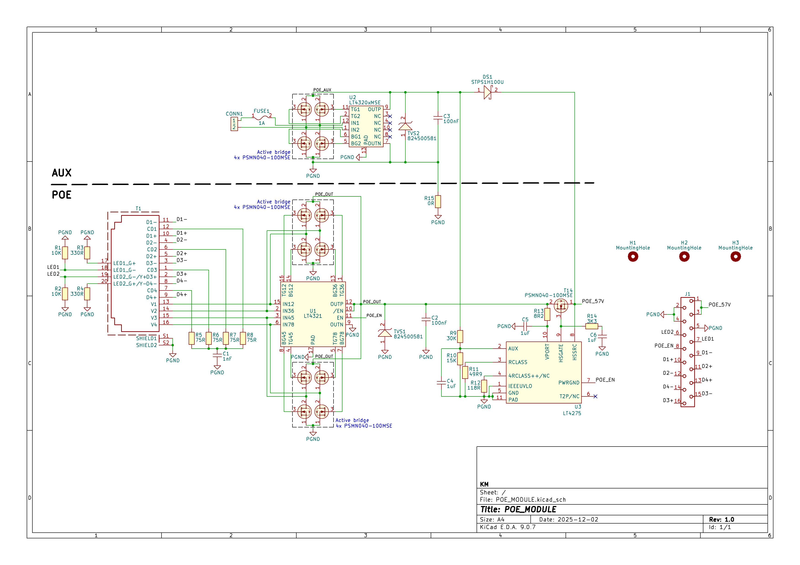
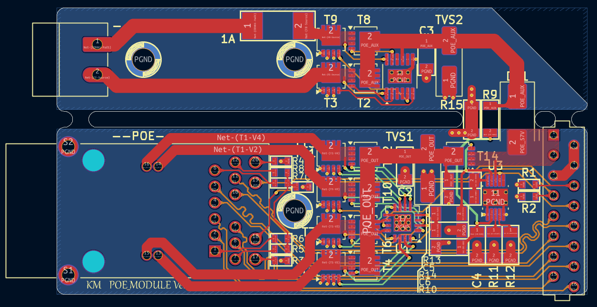
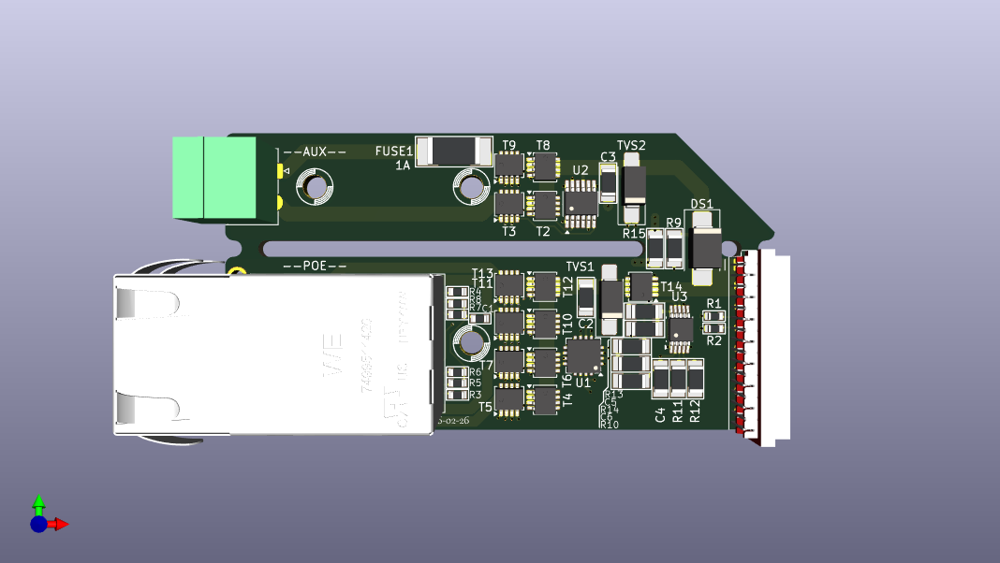
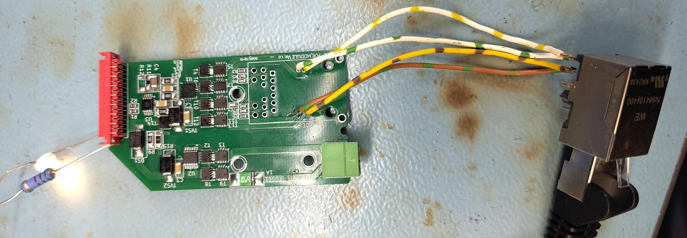
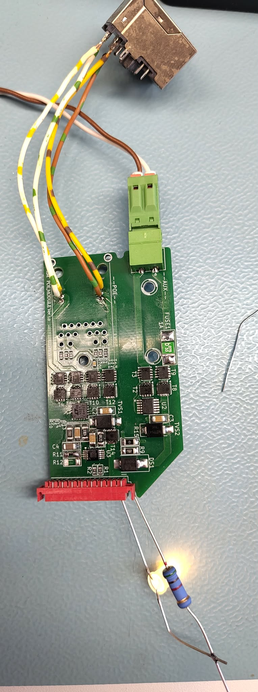

## 1. Introduction
A 100-W Power over Ethernet (PoE) module for device power supply and Ethernet data transmission.
## 2. Key Components:
- 7499511420 WÜRTH - PoE++ Ethernet connector with an integrated transformer, rated for 100 W power.
- PSM040-100MSE - MOSFETs forming active ideal bridge rectifier circuits.
- LT4321 - dual ideal bridge controller for PoE applications.
- LT4320 - single ideal bridge controller, used for the auxiliary power section.
- LT4275 - PoE controller.

## 3. PCB
The designed PCB is divided into two independent functional blocks: PoE and AUX.
The PoE section provides the primary power supply compliant with the Power over Ethernet standard, while the AUX section serves as an alternative, redundant power source intended for operation in the absence of power from the PSE device or in the event of a PoE path failure.

The AUX section allows the module to be powered either from an external DC voltage source or from mains voltage after prior step-down conversion. This solution increases application flexibility and enables the module to be used in systems requiring high power-supply reliability. In cases of space constraints, the AUX section can be mechanically separated—the corresponding part of the PCB may be broken off before component assembly without affecting the correct operation of the PoE section.

The output power of the module can be configured by selecting appropriate resistor values connected to the RCLASS and 4RCLASS++ pins of the LT4275 controller. This allows easy adjustment of the power class to meet specific application requirements without modifying the rest of the design.

To improve energy efficiency and reduce power losses, active bridge rectifiers were used. This approach enables higher output power while significantly reducing thermal losses compared to conventional diode bridges, which is particularly important in ~100 W applications with limited heat dissipation capability.

The use of widened power traces and connection of three connector pins for each power rail ensures safe and stable current flow of up to 1 A without excessive voltage drops or local trace overheating.
Ethernet signal traces were designed with controlled impedance in accordance with differential transmission requirements. Trace widths and spacing between differential pairs were selected to ensure proper characteristic impedance, minimizing signal reflections and preserving signal integrity.

## 4. TEST
Due to the high cost of components required to support the full 100 W power level, the current version of the module has been configured for a maximum output power of 25 W. This allowed verification of the power-supply architecture, the PoE power path, and the overall design assumptions while keeping prototyping costs under control.
For testing purposes, an Ethernet connector compliant with PoE Type 2 was used, enabling safe functional testing and validation of system behavior under conditions corresponding to a lower power class. Configuration of the PoE controller operating parameters is achieved by adjusting the values of the configuration resistors.

